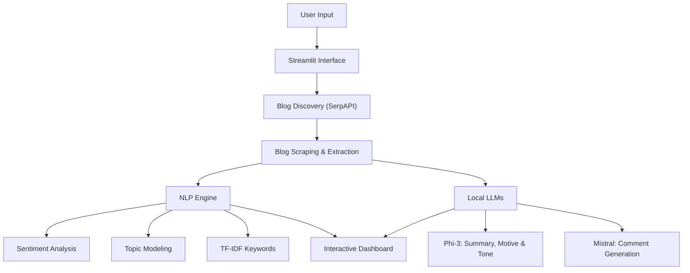
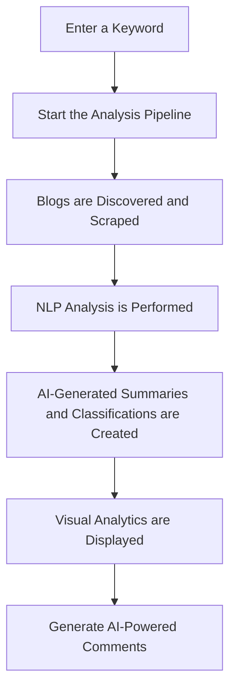

# 🧠 AI Blog Intelligence System

An intelligent end-to-end blog analysis platform that combines **web scraping, Natural Language Processing (NLP), local Large Language Models (LLMs), and interactive data visualization** to extract meaningful insights from blogs and their discussions.

The system automatically discovers blogs related to a user-defined topic, analyzes their content, identifies sentiment and themes, extracts important keywords, and generates human-like comments using locally hosted AI models.

---

## 🚀 Project Overview

The **AI Blog Intelligence System** was developed to simplify the process of understanding online discussions and blog content through AI-powered analysis.

Instead of manually reading multiple blogs, users can enter a keyword and let the system:

* Discover relevant blogs from the web.
* Extract blog content and discussions.
* Analyze sentiment and engagement.
* Identify topics and keywords.
* Generate summaries and insights.
* Produce human-like comments using local LLMs.
* Visualize findings through an interactive dashboard.

---

## ✨ Features

### 🔍 Smart Blog Discovery

* Searches blogs related to a given keyword using Google Search.
* Collects blogs from multiple domains.
* Prioritizes blogs containing active discussions and comments.

### 📰 Blog Content Extraction

* Extracts:

  * Blog title
  * Author information
  * Publication date
  * Full article text
  * User comments

### 📊 NLP-Powered Analysis

* Comment sentiment analysis using **VADER**.
* Topic discovery using **Hybrid LDA Topic Modeling**.
* Keyword extraction using **TF-IDF**.
* Content classification.

### 🤖 Local AI Analysis

Using Ollama-powered LLMs:

#### Phi-3

Generates:

* Blog summaries
* Content motives
* Writing tone classifications

#### Mistral

Generates:

* Human-like comments inspired by existing discussions.

### 📈 Interactive Dashboard

Visualizes results through:

* Sentiment Analysis Charts
* Content Motive Distribution
* Engagement vs Sentiment Analysis
* Discussion Word Clouds
* Blog Insight Panels

### 💬 AI Comment Generator

Creates realistic comments based on analyzed discussions and blog summaries.

---

## 🏗️ System Architecture


---

## 🛠️ Tech Stack

### Frontend

* Streamlit

### Web Scraping

* Requests
* BeautifulSoup
* Newspaper3k
* SerpAPI

### NLP & Machine Learning

* NLTK
* VADER Sentiment Analyzer
* Scikit-learn
* TF-IDF Vectorizer
* CountVectorizer
* Latent Dirichlet Allocation (LDA)

### Local Large Language Models

* Ollama
* Phi-3
* Mistral

### Data Processing

* Pandas
* NumPy

### Visualization

* Matplotlib
* Seaborn
* WordCloud

---

## 📂 Project Structure

```
AI-Blog-Intelligence-System/
│
├── app.py
├── file1.py
├── nlp_engine.py
├── visuals.py
├── comment_generation.py
├── analyzed_blogs.csv
├── data_mining_dashboard.png
├── requirements.txt
└── README.md
```

### Module Descriptions

| File                    | Purpose                                |
| ----------------------- | -------------------------------------- |
| `app.py`                | Streamlit user interface and workflow  |
| `file1.py`              | Blog scraping and data mining pipeline |
| `nlp_engine.py`         | NLP analysis and local AI integration  |
| `visuals.py`            | Dashboard visualizations               |
| `comment_generation.py` | Human-like comment generation          |

---

## ⚙️ Installation

### Clone the Repository

```bash
git clone https://github.com/yourusername/AI-Blog-Intelligence-System.git
cd AI-Blog-Intelligence-System
```

### Create a Virtual Environment

```bash
python -m venv venv
```

Activate it:

Windows:

```bash
venv\Scripts\activate
```

Linux/Mac:

```bash
source venv/bin/activate
```

### Install Dependencies

```bash
pip install -r requirements.txt
```

---

## 🤖 Install Ollama Models

Ensure Ollama is installed.

Pull the required models:

```bash
ollama pull phi3
ollama pull mistral
```

Start Ollama before running the application.

---

## ▶️ Running the Application

Launch the Streamlit application:

```bash
streamlit run app.py
```

Open the provided local URL in your browser.

---

## 🔄 Workflow



---

## 📊 Sample Dashboard Outputs

The dashboard provides:

* Blog summaries and metadata
* Sentiment scores
* Topic themes
* Keyword insights
* Engagement metrics
* Word clouds
* AI-generated comments

> Add screenshots of your dashboard here for better presentation.

---

## 📚 Key Learnings

Through this project, I gained experience in:

* Web scraping and data acquisition
* Natural Language Processing
* Topic Modeling
* Sentiment Analysis
* Local LLM integration
* Prompt Engineering
* Streamlit application development
* Interactive dashboard design
* Building end-to-end AI pipelines

---

## 🔮 Future Improvements

* Support additional LLM models.
* Export reports as PDF.
* Add user authentication.
* Perform multi-language analysis.
* Introduce real-time monitoring.
* Deploy using Docker and cloud services.
* Improve topic modeling with BERTopic.

---

## ⚠️ Disclaimer

This project was developed for educational and research purposes. The generated analyses and AI outputs should not be considered definitive interpretations of online discussions.

---

## 👨‍💻 Author

**Bushra Ansar**
